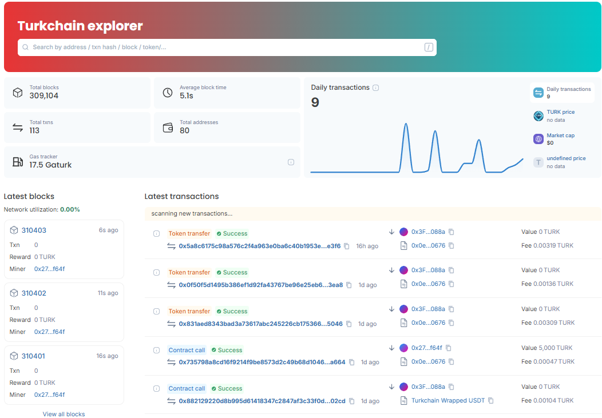

# Welcome to TurkScan

TurkScan is the official blockchain explorer of the Turkchain Layer-1 Network.

It provides real-time visibility into:

• Blocks\
• Transactions\
• Accounts\
• Smart Contracts\
• Tokens (TC-20, ERC-20, ERC-721, ERC-1155)\
• Network statistics

Explorer URL:\
https://turkscan.com

<figure><figcaption></figcaption></figure>

