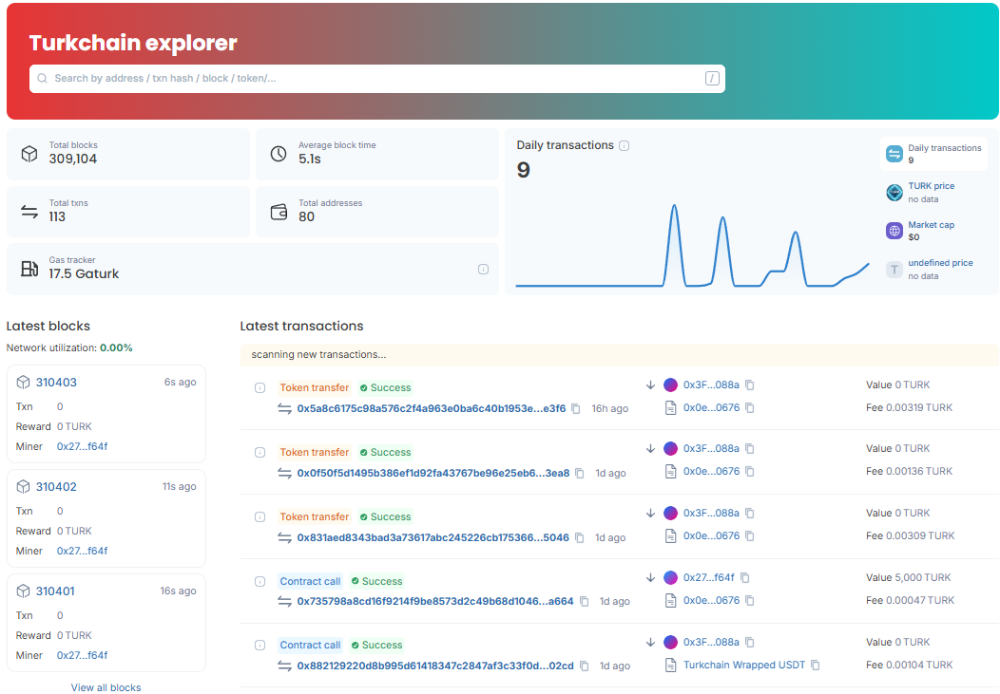

# Welcome to TurkScan

TurkScan is the official blockchain explorer of the Turkchain Layer-1 Network.

It provides real-time visibility into:

• Blocks\
• Transactions\
• Accounts\
• Smart Contracts\
• Tokens (TC-20, ERC-20, ERC-721, ERC-1155)\
• Network statistics

Explorer URL:\
https://turkscan.com

<figure><figcaption></figcaption></figure>

### Turkchain Ecosystem & Integrations

Turkchain is an EVM-compatible Layer-1 blockchain with Chain ID **1919**, native token **TURK**, and an expanding interoperability and Web3 infrastructure ecosystem.

This section provides official references to Turkchain's blockchain registries, wallet integrations, interoperability infrastructure, IBC connectivity, explorer, and developer resources.

🔗 Blockchain & Network Registries

**ChainList**\
Turkchain is registered on ChainList with Chain ID 1919 and TURK as the native currency. ChainList provides network information for connecting wallets and Web3 infrastructure to Turkchain.

**Ethereum Chain Registry**\
Turkchain is listed in the Ethereum-compatible chain registry with Chain ID 1919, EVM information, RPC endpoint and explorer configuration.

→ [Ethereum Chain Registry – Turkchain](https://github.com/ethereum-lists/chains/blob/master/_data/chains/eip155-1919.json?utm_source=chatgpt.com)

**DeFiLlama ChainList Registry**\
Turkchain's EVM network configuration is also maintained in the DeFiLlama ChainList repository.

→ [DeFiLlama – Turkchain Chain Configuration](https://github.com/DefiLlama/chainlist/blob/main/constants/additionalChainRegistry/chainid-1919.js?utm_source=chatgpt.com)

**Cosmos Chain Registry**\
Turkchain is represented in the Cosmos ecosystem registry.

→ [Cosmos Chain Registry – Turkchain](https://github.com/cosmos/chain-registry/tree/master/turkchain?utm_source=chatgpt.com)

→ [Cosmos Directory – Turkchain](https://cosmos.directory/turkchain?utm_source=chatgpt.com)

## 🌉 Interoperability & Cross-Chain

### Hyperlane

Turkchain has been added to the official Hyperlane Registry. The Hyperlane pull request **#1450 was merged on June 13, 2026**, adding Turkchain mainnet metadata including Chain ID/Domain ID 1919, RPC, explorer and Blockscout API information.

→ [Hyperlane Registry – Turkchain](https://github.com/hyperlane-xyz/hyperlane-registry/tree/main/chains/turkchain?utm_source=chatgpt.com)

→ [Hyperlane Integration PR #1450](https://github.com/hyperlane-xyz/hyperlane-registry/pull/1450?utm_source=chatgpt.com)

### IBC / Osmosis

Turkchain has an IBC connection with Osmosis recorded in the Cosmos Chain Registry. The registry currently shows the Osmosis–Turkchain connection as **ACTIVE**, using ICS-20 transfer channels.

→ [Osmosis ↔ Turkchain IBC Configuration](https://github.com/cosmos/chain-registry/blob/master/_IBC/osmosis-turkchain.json?utm_source=chatgpt.com)

### Axelar

Turkchain has submitted a mainnet configuration to the Axelar configuration repository. The referenced PR documents Turkchain's Chain ID 1919, TURK token, RPC and explorer information. However, the PR was closed and Axelar noted that full chain connectivity requires its Amplifier integration and governance process.

→ [Axelar – Turkchain Mainnet PR #362](https://github.com/axelarnetwork/axelar-configs/pull/362?utm_source=chatgpt.com)

## 👛 Wallet Integration

### Keplr

Turkchain is registered in the Keplr chain registry for both its EVM and Cosmos interfaces.

The EVM configuration uses **eip155:1919**, RPC `https://rpc.turkscan.com`, TURK as the native currency and 18 decimals.

→ [Keplr EVM – Turkchain 1919](https://github.com/chainapsis/keplr-chain-registry/blob/main/evm/eip155%3A1919.json?utm_source=chatgpt.com)

→ [Keplr Cosmos – Turkchain 1919](https://github.com/chainapsis/keplr-chain-registry/blob/main/cosmos/1919.json?utm_source=chatgpt.com)

## 🔎 TurkScan Explorer

**TurkScan** is the official blockchain explorer for the Turkchain network.

→ [Open TurkScan Explorer](https://turkscan.com/?utm_source=chatgpt.com)

**RPC Endpoint**

`https://rpc.turkscan.com`

## 💻 Developer & Open Source

Turkchain's development resources and ecosystem configurations are publicly maintained through GitHub.

→ [Turkchain GitHub Organization](https://github.com/Turkchain1919?utm_source=chatgpt.com)

→ [Cosmos Chain Registry – Turkchain](https://github.com/cosmos/chain-registry/tree/master/turkchain?utm_source=chatgpt.com)
