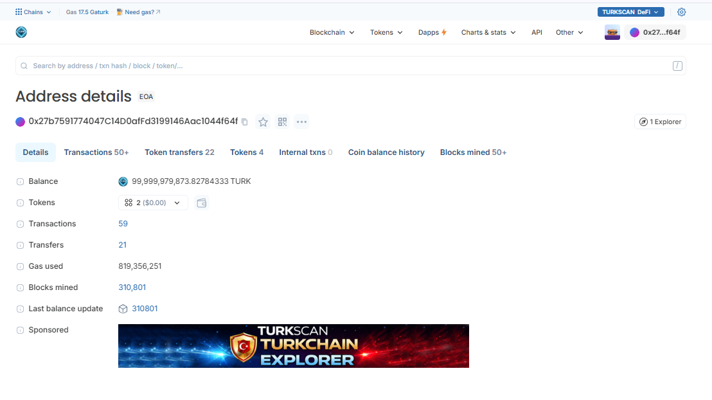

# Account Overview

```
An account page on TurkScan provides a complete overview of a wallet or contract address on the Turkchain network.
```

### Address Page Structure

Each account page includes:

• Address\
• TURK balance\
• Token balances\
• Transaction count\
• Transaction history\
• Internal transactions\
• Contract information (if applicable)

### Balance Section

```
## Balance
```

The balance section displays:

• Native TURK balance\
• Fiat equivalent (if enabled)\
• Token portfolio value

### Transaction List

```
## Transaction History
```

The transaction list displays:

• Transaction hash\
• Block number\
• Timestamp\
• From / To\
• Value transferred\
• Gas used\
• Status

<figure><figcaption></figcaption></figure>
