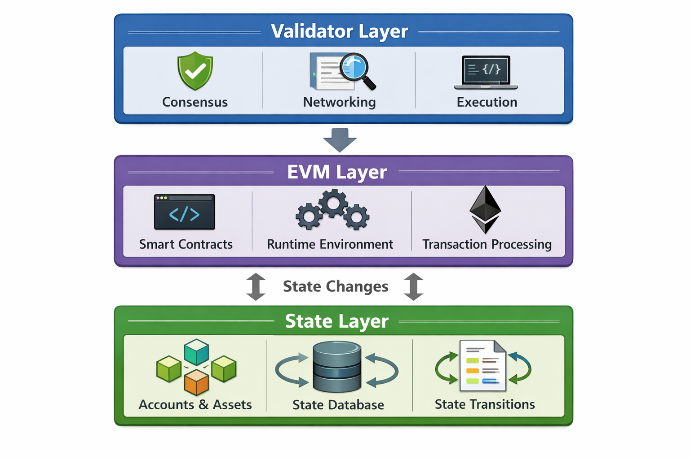

# Architecture Overview

Turkchain is built on a modular blockchain architecture composed of:

1. Consensus Layer
2. Execution Layer (EVM Engine)
3. State & Storage Layer

### Consensus Layer

Validator-based Byzantine Fault Tolerant consensus ensures:

• Fast block finality\
• Deterministic execution\
• High throughput\
• Network security

```
## Execution Layer (EVM Engine)
```

```
Turkchain natively integrates the Ethereum Virtual Machine, enabling:

• Solidity smart contract deployment  
• Ethereum-compatible bytecode execution  
• Web3 tooling support  
• Hardhat & Foundry integration  
• MetaMask compatibility
```

```
 State & Storage Layer
```

<figure><figcaption></figcaption></figure>
